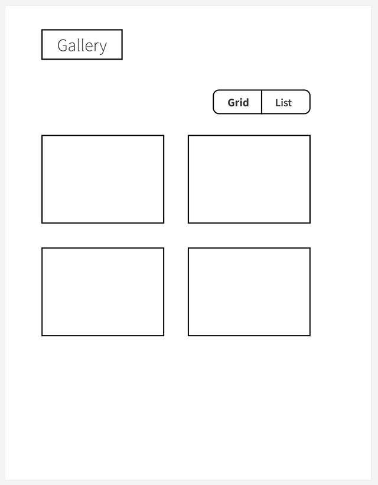
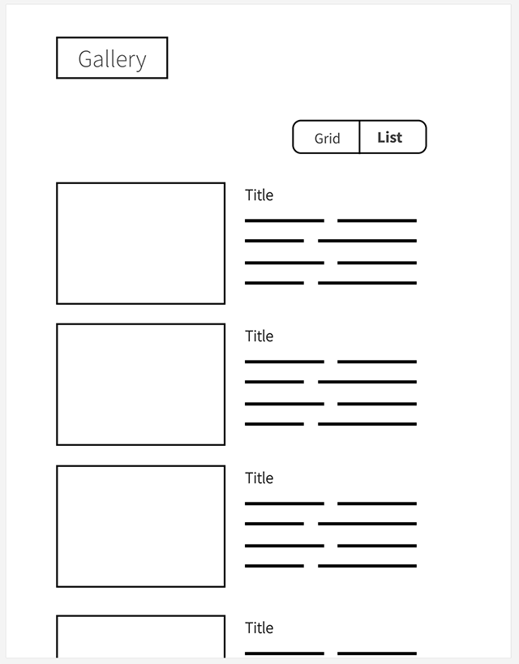

# Hiring-FE-gallery

A sandbox project to build a gallery.

This project was bootstrapped with [Create React App](https://github.com/facebook/create-react-app).

## What we're building

Our goal is to build a simple image gallery with the ability to display a static list of photos either in grid mode or list mode.

_Grid mode:_

_List mode:_

## Resources for the project

* `images.json` contains the list of images
* The actual image files are in `public/images/*.jpg`
* `translations.json` contains translations of UI element labels

## Instructions

We'd like to build out this page as a React-powered webapp.

If you are new to React, you can start with Step (1) and we'll eventually get to the React parts.

If you've working with React before or understand how it works, you can skip to step (2).

Feel free to make progress on the below before your interview, but try not to spend more than 1 hour on it. We'll pick up from where you leave off together in the interview session.

### (0) Setup

* Install the required dependencies:
  * `npm install`
* In the project directory, you can run:
  * `yarn start`
  * That runs the app in the development mode.
* Open [http://localhost:3000](http://localhost:3000) to view it in the browser.
* For the React exercise, the page will reload if you make edits. You will also see any lint errors in the console.

### (1) Mock out the UI in HTML & CSS.

* There are placeholder files under `/public/html`. We'll be using these as temporary resources to start coding the markup and styles for this project.
* To access them and iterate on your UX, you can simply load the pages via your browser as a static resource
  * i.e., navigate your browser to [http://localhost:3000/html/list.html](http://localhost:3000/html/list.html) (or grid.html)
  * You'll need to manually refresh this page to see any changes reflected.
* Take the first few images and lay them out with HTML markup and CSS styles to get a UX like the "List view."
  * What HTML tags and attributes will you use?
  * Style the page and its elements with CSS using the linked stylesheet and/or an internal style definition. Try to create a page that is clear and functional, and looks decent (or better).
* Do the same for Grid View. You don't have to hardcode all the images. Just use the first few to provide a structure for the page and its contents.
* Check in whatever code you've written for these files.
* Once done with this, it's time to dive into React! If you are new to this library, start here: https://beta.reactjs.org/. We'll be using this as we move to (2) below.

### (2) Create React components and interactions to display either the grid or list views.

Now we'll get into the React portion. Let's create some components.

* Think about the component or components you'd create to achieve this design and interaction.
  * What are the component names and boundaries? What props do they need?
* Start with the components needed for one of the views (Grid or List).
* Then create the components (or adjust existing components) to handle the other view.
* How can you hook up the interactions such that clicking the toggle pill for Grid or List changes the view?
* What else should you think about when coding this page?
  * Feel free to write some "TODO" comments in the code about what else needs to be done or defined.
* Check in whatever code you've written for the react app. 
* There's more to do to make this even better, stay tuned!

Throughout the process, feel free to create commits in git as you normally would when building something new.

